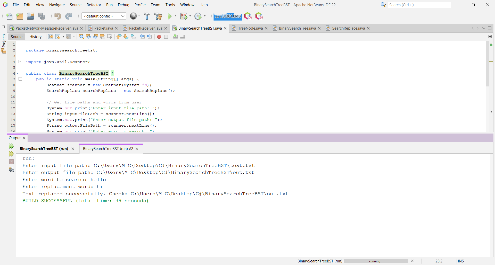
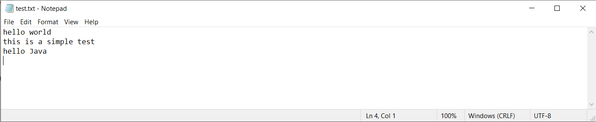
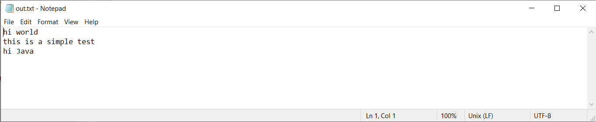

# BinarySearchTreeBST

# 🌳 Search and Replace Text using a Binary Search Tree (BST)
This project implements **search and replace functionality** for a large text file using a **Binary Search Tree (BST)**.  
The BST efficiently stores words from the file, allowing fast searching and replacement.

---

## 📌 Project Overview
This program allows users to:
✔ **Efficiently search** for words using a BST  
✔ **Replace** all occurrences of a word  
✔ **Handle large files** by processing them line-by-line  
✔ **Take user input** for search and replacement words  

---

## 🎯 Why Use a Binary Search Tree (BST)?
- **Fast Lookups**: BST allows quick word searching.  
- **Efficient Storage**: Words are stored in sorted order.  
- **Scalable**: Handles large text files efficiently.  

---

## ⚙️ How It Works
### 🔹 1. Reading the File Efficiently
- The file is read **line by line** to handle large files.
- Each line is split into words.

### 🔹 2. Storing Words in a BST
- Every word from the file is inserted into a **Binary Search Tree**.
- This allows fast searching when replacing words.

### 🔹 3. Searching and Replacing Words
- The BST is **checked** to find occurrences of the search word.
- If found, the word is **replaced**.

### 🔹 4. Writing to a New File
- The modified content is **saved to an output file**.

---

## 🚀 Example Execution
### **Input File (`input.txt`)**

---

## 📸 Screenshots
### 🔹 Sample Execution Output  

### 🔹 Modified File Preview  

### 🔹 Modified File Preview  

